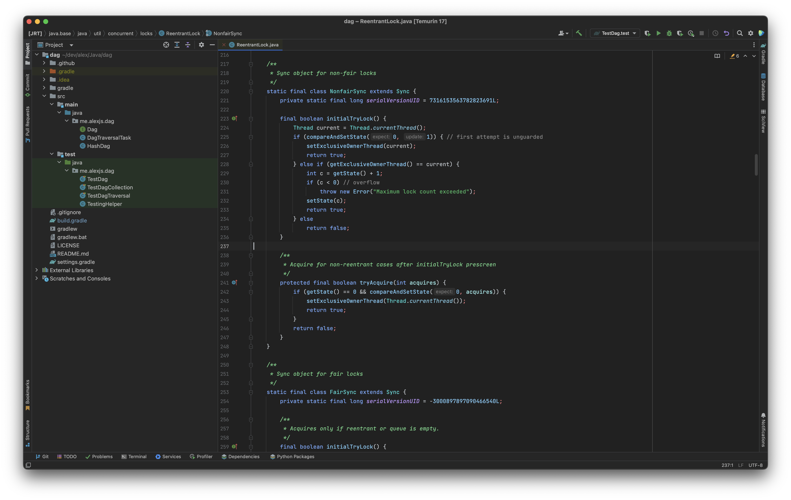
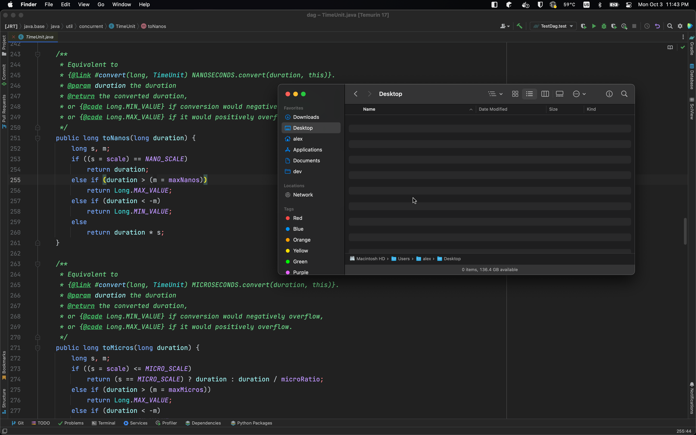
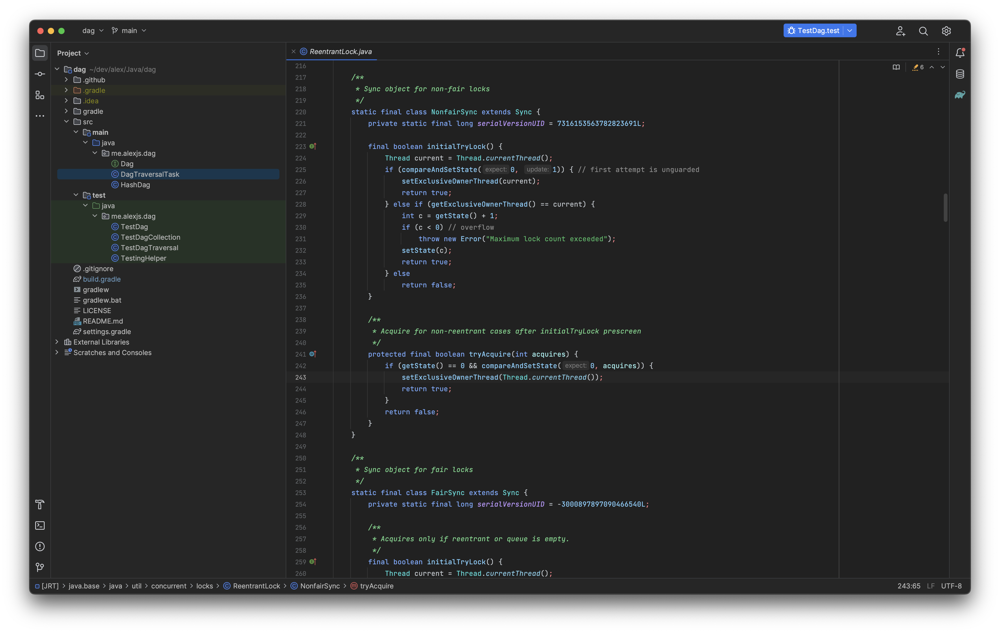
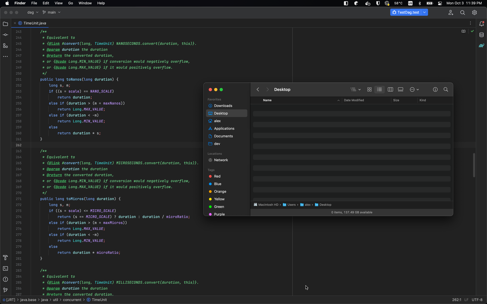

# Darcula Liquid

A fork of [Darcula Solid](https://github.com/vecheslav/darcula-solid) with a lovely color scheme

## Notes

Make sure you change `Preferences > Editor > Color Scheme > Scheme` to "Darcula Liquid" if it doesn't change automatically

If you have color theme changes you'd like to see here, please [create a Pull Request](https://github.com/ajs1998/darcula-liquid/pulls). Use this [Jetbrains guide for developing a theme](https://plugins.jetbrains.com/docs/intellij/developing-themes.html) to get you started. IntelliJ makes it very easy to make changes to these theme files.

For some reason, the fullscreen screenshots here (with Finder open) look slightly off. Maybe image compression? It looks like the contrast was cranked up when the IDE is not in focus. The source image files show the correct color values when I open them locally, but not on GitHub or the plugin page. So I'm not sure what's going on. If anyone knows why it looks different, please tell me.

And here are some screenshots with IntelliJ's new UI preview in 2022.3 EAP:

